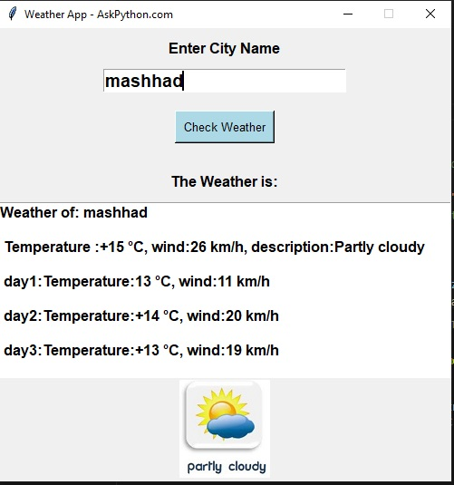
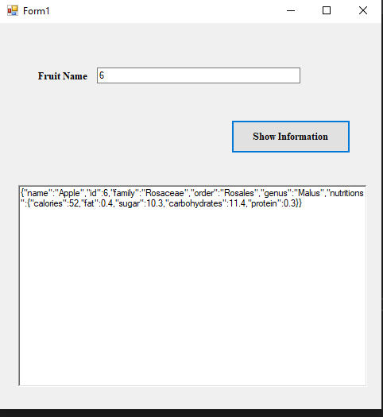
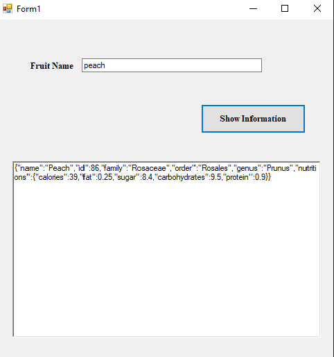
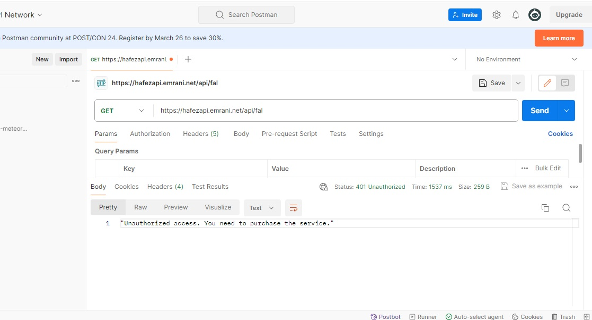
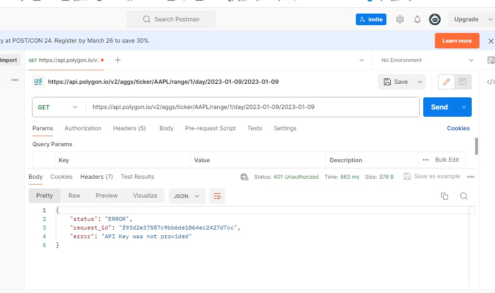

# GUI based Weather App


# Description :
Here, we are going to create a weather application using API from https://goweather.herokuapp.com/weather/{location} and Qt Designer .


# How to install 

``` 
pip install -r requirements.txt
```

# How to run 

python Assignment-01.py


# Results 












API token:

https://hafezapi.emrani.net/api/fal

https://api.polygon.io/v2/aggs/ticker/AAPL/range/1/day/2023-01-09/2023-01-09
